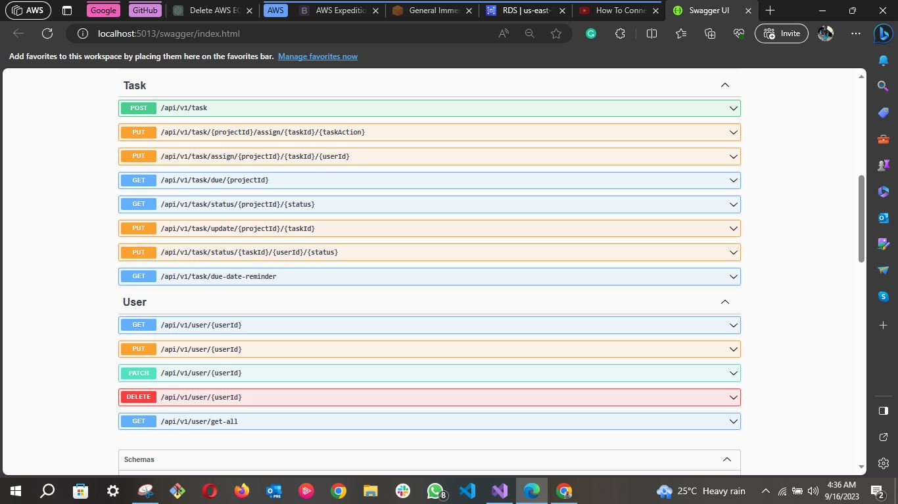

# Task Management System

## Overview

This Task Management System is a robust platform developed using ASP.NET Web API, designed to efficiently manage and notify users about various task-related activities. The system not only ensures seamless task management but also employs various cutting-edge technologies to maintain a high standard of reliability and functionality.

## API Image Overview
### Each image contains two API Group/Tag.

| <h1>
 Auth and Project 
</h1>             |   
|---------------------------------|
| 
| <h1>
Task and User 
</h1>                   |
||

## System Architecture

### Core Components:

- **Web API**: The main interface for all task-related operations developed using ASP.NET.
  
- **Worker Service**: Responsible for background tasks especially in notification processing.
  
- **AWS SQS**: Utilized for processing notifications for various task events.
  
- **Email Service Providers**: 
  - **AWS SES**: The primary email service provider.
  - **MailKit**: Used as a secondary or backup email service provider.

### Notification System:

Users are notified:
- When they create new account: email verification.
- When the sign-in but there email is not verified.
- When a task is marked as completed.
- 48 hours before a task's due date.
- When a new task is assigned to them.

### Deployment:

- **GitHub Actions**: Used for CI/CD to automate the deployment process.
  
- **AWS ECS with ECR**: Hosts and deploys our containers for both the Web API and the background service.

## Setting Up / Installation

Certainly! Here's the enhanced `Usage` section for your `README.md`:

---

## Usage

### Setup and Configuration:

Before running the application, provide the following credentials and configurations in the `appSetting.json` file.

1. **SSMS Connection String**: A valid connection string for SQL Server Management Studio (SSMS).
2. **AWS SQS Queue URL**: A valid URL pointing to your AWS SQS queue.
3. **SMTP Credentials for MailKit(REQUIRED)**: Valid SMTP credentials to send emails using MailKit.
4. **SMTP Credentials for AWS SES (OPTIONAL)**: Valid SMTP credentials for sending emails via AWS Simple Email Service (SES).
5. **AWS Configuration**: 
   - **Profile**: A valid AWS profile.
   - **Region**: The AWS region (e.g., `us-east-1`).
   - **AccessKey**: Your AWS access key.
   - **SecretKey**: Your AWS secret key.
6. **Redis Configuration**: Ensure Redis is running, listening on port `6379`. or you can change the port on the configuration file. `appsetting.json` in both the worker service and the API.

`NOTE` 
   - Your have to provide some of these credentials in the `appSetting.json` file of the web api in the `appSetting.json` file for background service project too.
   - The boilerplate/structure to follow is already provided in the `appSetting.json` file, you just need to insert the values for each sections. Never you tamper with the structure as the `AppSetting.cs` class binds these values during application startup to enable type safety.

### Running the Application:

1. **Start Services**: Begin by running the background worker service project. Once that's up and running, start the Web API.
   
2. **Account Creation**: 
   - Upon the first run, you should create an account through the API.
   - An email will be sent to the provided email address for confirmation.
   
3. **Email Confirmation**:
   - Retrieve the one-time-password (OTP) from the confirmation email.
   - Navigate to the `verify-email` endpoint on the Swagger UI.
   - Input the email address used during registration and the received OTP. Note: Ensure this step is completed promptly as the OTP expires in 5 minutes.
   
4. **Testing CRUD Operations**:
   - To test project, task, and user CRUD operations, go to the `get all users` endpoint on Swagger.
   - From the list of users, copy your user ID.
   - Use this user ID to create a new project. Upon successful project creation, make note of the project ID.
   - With both the project ID and user ID, you're all set to test other CRUD operations on the Project and Task endpoints.

<h1>OR</h1>

#### You can avoid the complexity of setting up the project and test the live project [here]("https://aws.com/ecs/kellyncodes/jadra.api")
---

